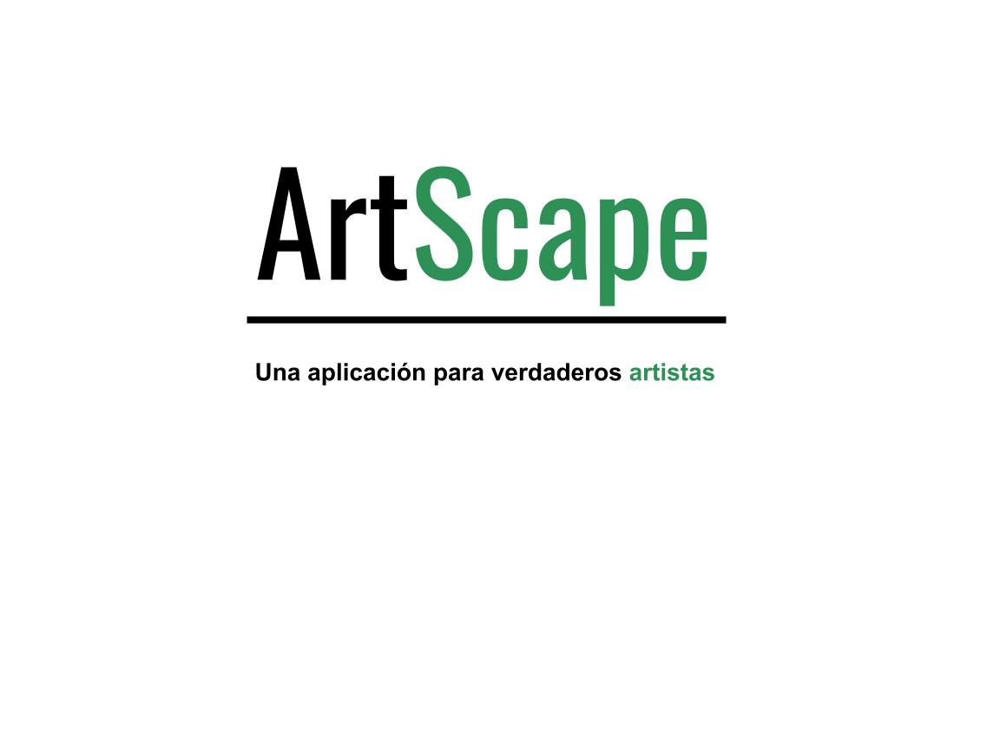

# ArtScape

ArtScape es una aplicación de dibujo en ordenador que surge como proyecto para un trabajo de la asignatura de Patrones Software. En esta aplicación el usuario podrá mediante teclado y ratón crear dibujos o modificarlos con las distintas herramientas que ofrece. 

De manera que la aplicación stará conformada por dos ventanas:
* Paleta: Ventana en la cual se encontrarán las herramientas de dibujo, paleta de colores y un pequeño menú de ajustes de la herramienta.
* Lienzo: Ventana de dibujo donde se permite dibujar con la herramienta seleccionada.

<a href="recursos/ArtScape Memo.pdf"><strong>Memeria del proyecto</strong></a>

